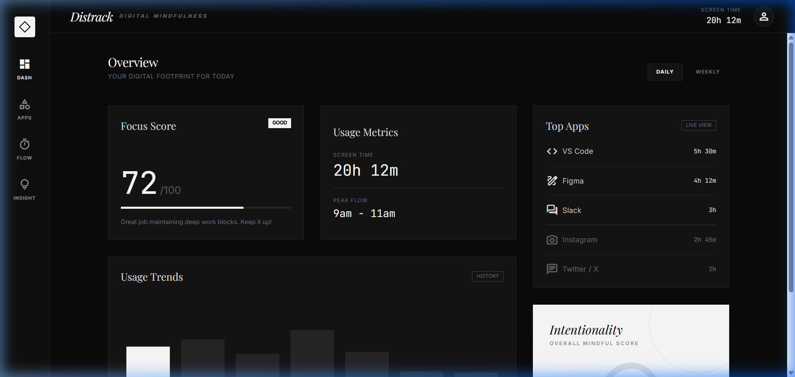
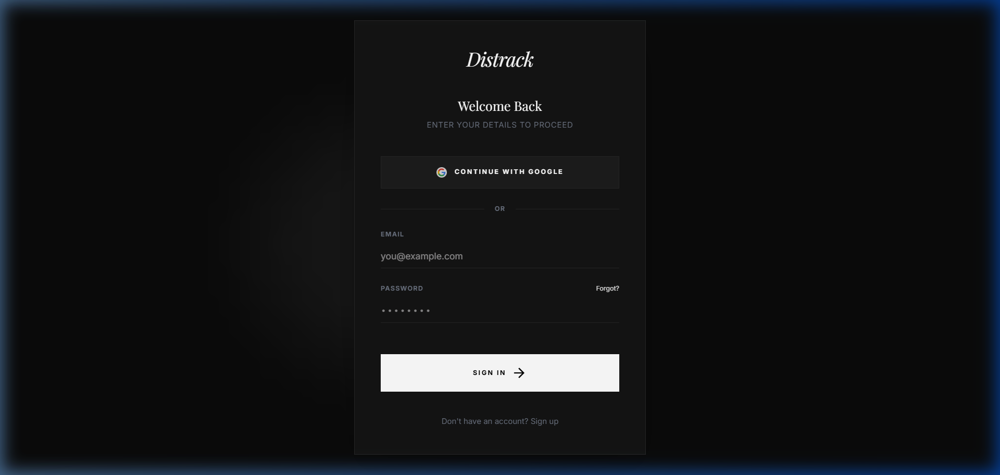

# Distrack

Distrack is a premium Windows desktop application designed for digital mindfulness. It helps you stay productive by tracking your real-time activity and providing powerful tools to manage your digital focus.



## Key Features

- **Real-time Activity Tracking**: Monitors your active Windows processes to provide accurate insights into your daily usage.
- **Deep Focus Mode**: Enforce productivity with a system-level app blocker that kills distracting processes in real-time.
- **Modern Dashboard**: A glassmorphic, dark-themed interface designed for clear visualization of your focus scores and usage trends.
- **Data Persistence**: All your tracking data is stored securely and locally on your machine.
- **Production-Ready**: Includes a fully configured build pipeline for generating Windows installers (.exe).

## The Interface

### Login & Onboarding
Distrack features a professional authentication flow, allowing you to sync your data securely.



### Focus & Insights
Track your "Focus Score" and identify your "Peak Flow" periods to optimize your workday.

## Tech Stack

- **Core**: Electron
- **Frontend**: React + Vite
- **Styling**: Vanilla CSS (Premium Custom Design)
- **Tracking**: Node.js Child Process + Win32 APIs

## Getting Started

### Prerequisites
- Node.js (v18+)
- npm

### Installation
1. Clone the repository
2. Install dependencies:
   ```bash
   npm install
   ```
3. Run in development mode (Electron + Vite):
   ```bash
   npm run desktop
   ```

### Building the Installer
To generate a production-ready Windows installer:
```bash
npm run build
npx electron-builder --win
```

## Security & Privacy
Distrack is designed with privacy in mind. Tracking data is stored locally in your `%APPDATA%` directory and never leaves your machine unless you explicitly configure cloud sync.

---
Built with focus by Distrack.
